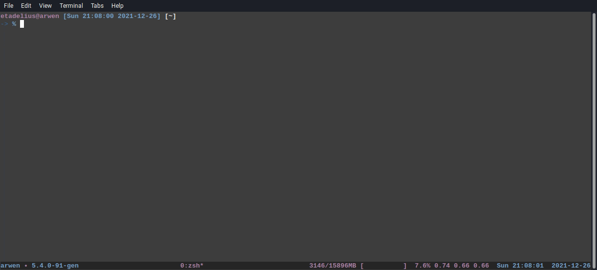

# Dotfiles

> In computing, a hidden folder or hidden file is a folder or file which
> filesystem utilities do not display by default when showing a directory
> listing.
>
> They are commonly used for storing user preferences or preserving the state of
> a utility, and are frequently created implicitly by using various utilities.

This repository configures my laptop automatically using Ansible.

## Before Setup

If we already have a configured machine, we should backup the GPG and SSH keys
into the file `$HOME/.password-store/keys.tar.gz.enc`. For that, we need to run
the following:

```bash
$ ./bin/export.sh
```

This machine should have:

- A folder called "$HOME/.password-store" with our Password Store already
  configured.
- A folder called "$HOME/.ssh" with our SSH keys and SSH configuration.
- A GPG key for signing Github commits.
- A GPG key for accessing our Password Store.
- A way to load our `.envrc` file e.g. [Hab](https://github.com/alexdesousa/hab).

Additionally, we need to have some of our passwords stored in our Password
Store already:

- `personal/github/dotfiles` should have our `vars/secrets.yml` password.
- `personal/gpg/github-key` should have our GPG Github key password.
- `personal/gpg/password-store` should have our GPG Password Store key password.

That way the variables in our `.envrc` file will be loaded correctly.

> **Note**: Before loading the variables, we'll need to provide your GPG
> Password Store key password in the dialog.

## Setup

In the new machine, we need to install Ansible:

```
$ sudo apt install ansible
```

then download the updated `keys.tar.gz.enc` file into our this project's root
and finally we need to run the following:

```bash
$  VAULT_PASSWORD="<... my vault password ...>" \
   GPG_GITHUB_KEY="<... my Github master password ...>" \
   GPG_PASSWORD_STORE_KEY="<... my Password Store master password ...>" \
   ./bin/engage.sh
```

The new machine doesn't have a configured Password Store yet, so that's why we
need to provide the environment variables by hand.

> **Important**: Remember the space at the beginning of the command to avoid
> logging the passwords in the command log.



## Raspberry Pi

The Raspberry Pi acts as a hub for random applications. After configuring the
main machine, we can run the following to configure it:

```bash
$ ./bin/rpi_engage.sh
```

This will install all dependencies and applications needed.

## Secrets Structure

The `vars/secrets.yml` file has the following format:

```yaml
keys_vault_password: "... Keys vault password ..."
base:
  git:
    name: "... My name ..."
    email: "... My email address ..."
exporter:
  gpg:
    github:
      public_key: "... My Github's public key ..."
    password_store:
      public_key: "... My Password Store public key  ..."
password_store:
  repo: "git@..."
```

And it's encrypted using the `$VAULT_PASSWORD` found in the Password Store
`personal/github/dotfiles`.

## Author

Alexander de Sousa.

## License

`Dotfiles` is released under the MIT License. See the LICENSE file for further
details.
